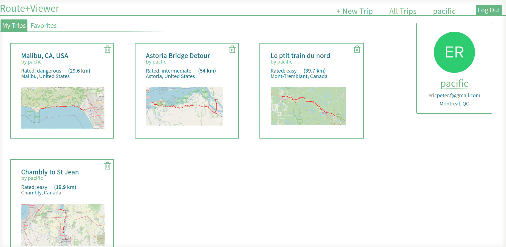
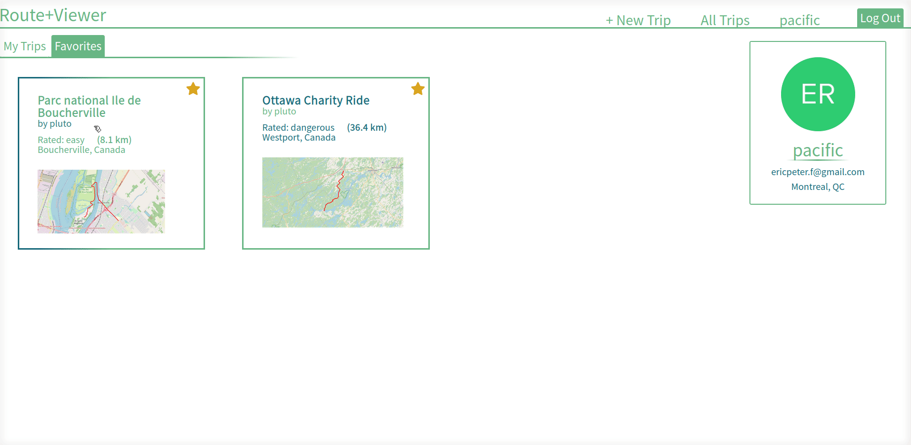
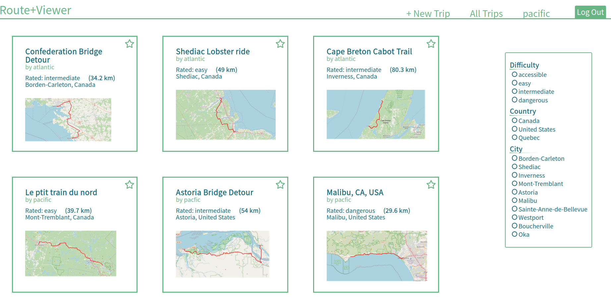
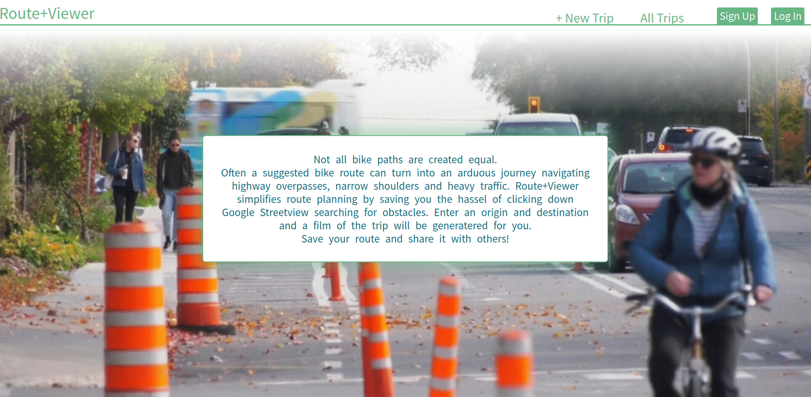

# StreetView-MovieMaker
This website creates a movie out of a route by stitching together Google Streetview images. After entering an origin and destination, users receive a bike route from OpenRoutingService. At steps along the path images are taken from Google Streetview Static Image API to simulate a dashcam movie. This tool helps cyclists plan journeys by allowing them to scan the route for safety hazards such as missing shoulders, or bridge crossings. Users can make notes, rate the trip and share it with others.

The project is built using React in the frontend and Node.js (express) in the backend. MongoDB handles the data and Auth0 provides the login/signup infrastructure. 

API's used include: Google Static StreetView, Google Places Autocomplete, Google Geocoding, and OpenRoutingService Directions.

---
## Map Flow
### The map flow takes users from origin/destination input to saving the trip. 

Locations are geocoded(lat/long) then posted to Openroutingservice to generate a bike trip. The trip is rendered on a Leaflet map. A modal popup displays a video of the route with options to pause,play and reset the video. Users can make notes and rate the trip, as well as edit the auto suggested location and title. Upon Saving the trip is added to that users profile and displays site wide for all users.

---
## User Profile
### Profiles display all trips created by the user as well as their favorite trips from other users.

This page displays all a users trips, with the option to delete trips. Favorite trips can be unfavorited.

---
## Trip Tile
### The trip tile links to the trip detail page, the authors profile, and filters on the all trips page

---
## All Trips 
### Displays all the trips on the site, with options to filter the results based on location or difficulty.

---
## Log In Flow
### Log in interface using Auth0.

Anonymous visitors can view trips, profiles, and filter all trips, without the option to favorite. Upon clicking a protected route, such as  `+New Trip` they are redirected to the log in screen.
